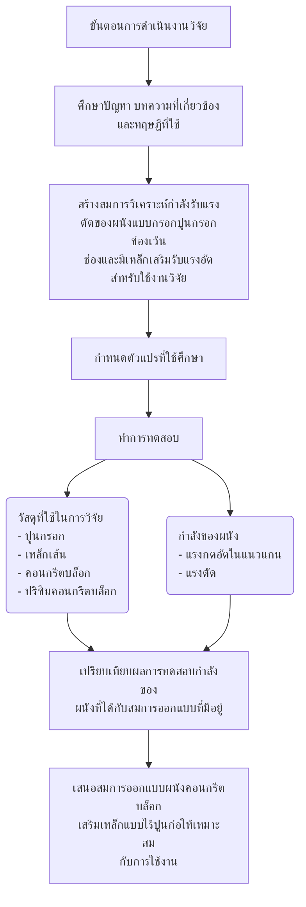

23

**รูปที่ 3.1 แผนภูมิแสดงขั้นตอนในการดำเนินงานวิจัย**

**3.2 การวิเคราะห์กำลังรับแรงดัดของผนังคอนกรีตบล็อกเสริมเหล็กแบบไร้ปูนก่อแบบกรอกปูนกรอกช่องเว้นช่องและมีเหล็กเสริมรับแรงอัด**

จากที่ได้กล่าวมาแล้วในบทที่ 2 ว่าจำเป็นเป็นต้องมีการสร้างสมการเพื่อใช้ในการวิเคราะห์และออกแบบผนังคอนกรีตบล็อกเสริมเหล็กแบบไร้ปูนก่อแบบกรอกปูนกรอกช่องเว้นช่องและมี
