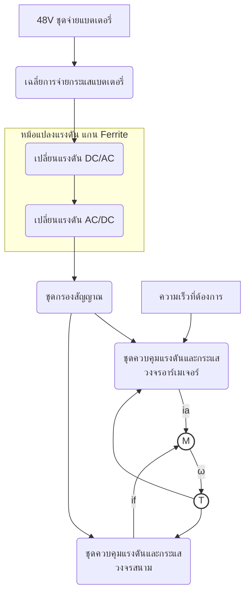

4

ต้องการ โครงสร้างของระบบที่พัฒนาขึ้นแสดงไว้ในภาพที่ 1.3 จะใช้การวัดความเร็วของมอเตอร์ มาเป็นสัญญาณป้อนกลับ เพื่อเปรียบเทียบกับสัญญาณที่ต้องการเข้าสู่ชุดควบคุมที่มีลักษณะการ ควบคุมเป็นแบบแอนาลอก พิจารณาภาพที่ 1.3 จะเห็นว่าระบบที่ต้องการพัฒนาขึ้นนี้มีองค์ประกอบ


```

**Diagram Text Components:**

* **Input:** 48V ชุดจ่ายแบตเตอรี่
* เฉลี่ยการจ่ายกระแสแบตเตอรี่
* Up (Label on connection)
* เปลี่ยนแรงดัน DC/AC
* หม้อแปลงแรงดัน แกน Ferrite (External component label)
* เปลี่ยนแรงดัน AC/DC
* ชุดกรองสัญญาณ
* **Control Input:** ความเร็วที่ต้องการ
* ชุดควบคุมแรงดันและกระแส วงจรอาร์เมเจอร์
* ชุดควบคุมแรงดันและกระแส วงจรสนาม
* **Motor Circuit:** M (Motor symbol), `ia` (Armature current label), `if` (Field current label)
* **Output/Sensor:** ω (Speed label), T (Sensor symbol)

ภาพที่ 1.3 แผนภาพแทนระบบที่ออกแบบและพัฒนาขึ้นของงานวิทยานิพนธ์นี้

หลายส่วนด้วยกันคือแหล่งจ่ายเป็นชุดพ่วงแบตเตอรี่ แบตเตอรี่เป็นชนิดตะกั่วกรดที่มีใช้กัน อยู่ทั่วไปในรถยนต์ปัจจุบัน เป็นอุปกรณ์ที่หาง่ายราคาถูก แบตเตอรี่แต่ละลูกมีการเก็บประจุไม่เท่ากันอันเนื่องมาจากลักษณะสมบัติของแบตเตอรี่ เมื่อนำมาต่อพ่วงกันเป็นแหล่งจ่ายพลังงานให้แก่ภาระ จึงต้องมีอุปกรณ์เฉลี่ยกระแสหรือเฉลี่ยประจุของแบตเตอรี่ภาระคือการดึงกระแสในแบตเตอรี่ แต่ละลูกให้มีระดับใกล้เคียงกัน แบตเตอรี่ในการวิจัยวิทยานิพนธ์นี้ จะใช้จำนวน 4 ลูกต่ออนุกรม เพื่อสร้างแรงดัน 48 Vdc ดังนั้นจะต้องมีชุดแปลงผันแรงดันขึ้นเพื่อให้ได้ขนาดแรงดันที่มอเตอร์ต้องการ โดยใช้หม้อแปลงชนิดที่เป็นแกนเหล็กความสูญเสียต่ำหรือแกนเฟอร์ไรท์ (ferrite) เป็น อุปกรณ์แปลงแรงดันขึ้น สัญญาณที่ได้ออกมาจากชุดแปลงผันแรงดันจะไม่เรียบจึงต้องใช้วงจร กรองสัญญาณในการปรับเรียบก่อนป้อนให้กับชุดควบคุมมอเตอร์ 
ชุดควบคุมแรงดันและกระแสอาร์เมเจอร์ ใช้ควบคุมความเร็วของมอเตอร์ ชุดควบคุมแรงดันและกระแสวงจรสนามจะทำงานสัมพันธ์กับการเปลี่ยนแปลงของอาร์เมเจอร์ เพื่อรักษาระดับความเร็วและแรงบิดให้ได้ตามที่ต้องการ โดยการเปลี่ยนแปลงความเข้มของสนามแม่เหล็ก ด้วยการ ปรับกระแสสนาม
