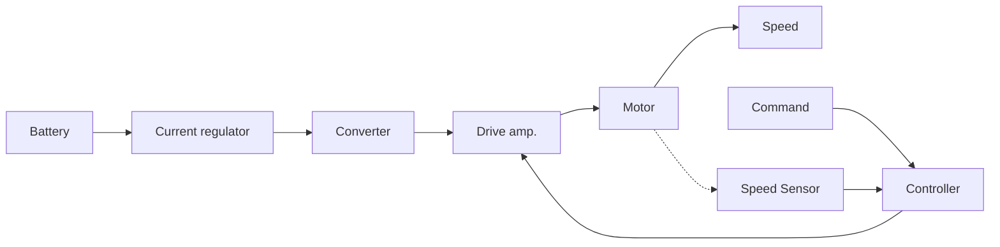

## บทที่ 2

แนวคิดการออกแบบระบบขับเคลื่อนมอเตอร์กระแสตรงชนิด
วงจรสนามแยกส่วนจ่ายกำลังด้วยแบตเตอรี่ตะกั่ว-กรด

### 2.1 บทนำ

ในระบบขับเคลื่อนมอเตอร์กระแสตรงชนิดวงจรสนามแยกส่วน ใช้พลังงานขับเคลื่อนจาก แบตเตอรี่ชนิดตะกั่วกรด โดยแปลงผันพลังงานจากแบตเตอรี่ที่ให้แรงดัน 48 Vdc เป็น 220 Vdc ตามพิกัดของมอเตอร์ที่ใช้ในงานวิทยานิพนธ์นี้ มีส่วนประกอบที่สำคัญ ดังแสดงในภาพที่ 2.1 ประกอบด้วย ชุดแบตเตอรี่ขนาด 48 Vdc อุปกรณ์จำกัดกระแส (current regulator) อุปกรณ์แปลงผันแรงดัน (converter) ตัวขับ (drive amplifier) มอเตอร์ไฟฟ้ากระแสตรง เซนเซอร์วัดอัตราเร็ว (speed sensor) และ ตัวควบคุม (controller)

ภาพที่ 2.1 แผนภาพบล็อกระบบควบคุมมอเตอร์ที่มีแหล่งจ่ายพลังงานเป็นแบตเตอรี่

อุปกรณ์ปรับเปลี่ยนแรงดันจะเปลี่ยนแรงดันของแบตเตอรี่ 48 Vdc ให้เป็น 220 Vdc เพื่อ จ่ายให้มอเตอร์ ตัวควบคุมจะทำหน้าที่สร้างสัญญาณบังคับอุปกรณ์ปรับเปลี่ยนแรงดัน เพื่อให้มอเตอร์ตอบสนองตามสัญญาณอ้างอิง โดยเซนเซอร์วัดความเร็วจะทำหน้าที่ส่งสัญญาณที่วัดได้ จากความเร็วเป็นเอาต์พุตของมอเตอร์มายังตัวควบคุม ซึ่งภายในอุปกรณ์ควบคุมนั้นจะมีส่วนของ การเปรียบเทียบสัญญาณที่ได้รับเข้ามา กับสัญญาณที่ปรับตั้งไว้เพื่อตรวจสอบผลการตอบสนองให้ เป็นไปตามที่ต้องการ โดยอุปกรณ์ทั้งหมดจะเป็นแบบแอนาลอกซึ่งรายละเอียดจะได้กล่าวถึงแนว คิดการออกแบบอุปกรณ์ดังที่ได้กล่าวมาแล้วข้างต้นในบทนี้
